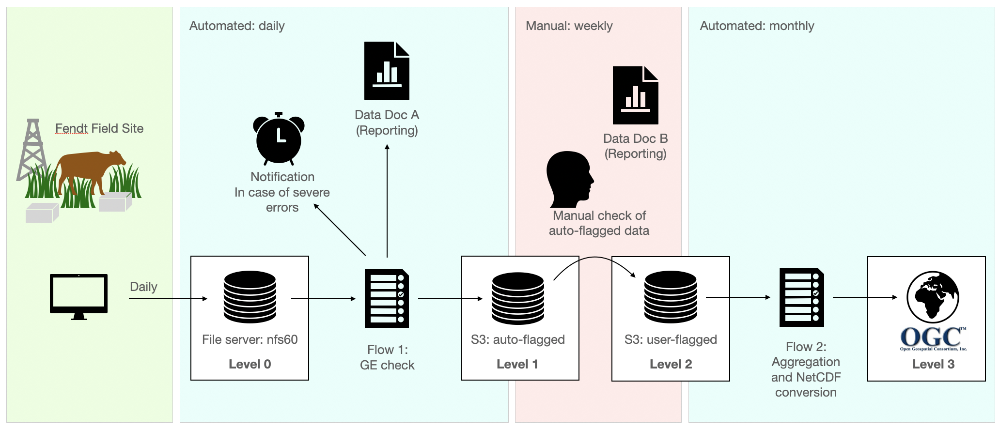

# dataflow

[](https://github.com/prefectHQ/prefect)


[](https://github.com/psf/black)


Demo data pipeline for [TERENO](https://www.tereno.net) and other station data.

|  | 
|:--:| 
| *General schema for the dataflow* |

## How to work with the prefect.io / docker setup

1. Build prefect flow base image, tag it and push to docker.io
2. Run flow.py script and register with the prefect server on kead1
3. Trigger execution or set a schedule

### Building the base image

Currently the docker.io docker registry is used. To create the base image for the prefect flow build and tag the image. To allow for a consistent versioning follow the *SemVer* versioning scheme.

```
docker build -t cwerner/dataflow:latest .
docker push cwerner/dataflow:latest

# semver versioning (major.minor)
docker tag cwerner/dataflow:latest cwerner/dataflow:0.1
docker push cwerner/dataflow:0.1

# semver versioning (major.minor.patch)
docker tag cwerner/dataflow:latest cwerner/dataflow 0.1.0
docker push cwerner/dataflow:0.1
```

Or use the publish.sh script to achieve the same thing like so:
```
./publish.sh 0.1.0
```

### Implemented Expectation suites

In DataFlow multiple expectation suites will be evaluated on raw data.

1. Warning  
*Purpose:* Non-data specific checks (number of row, columns, consecutive time-stamps, number of NaN etc.)
2. Basic  
*Purpose:* Sensor/ Variable specific checks (mostly, min/ max range checks, number of consecutive constant values, etc.)
3. Advanced   
Potentially applied on level1/ level2 data.  
*Purpose:* More sophisticated checks (i.e. trend deviations, pulse event detection, etc.)


### Prepare the s3 bucket for data docs

```
sgws s3api put-bucket-policy --bucket dataflow-ge-docs --policy file://website.json
```

The policy file:

```
{   
    "Statement": [     
        {       
            "Effect": "Allow",
            "Principal": "*",       
            "Action": ["s3:GetObject", "s3:ListBucket"],
            "Resource": [
                "urn:sgws:s3:::dataflow-ge-docs",         
                "urn:sgws:s3:::dataflow-ge-docs/*"       
            ]     
        }   
    ] 
}
```

The data docs should be present at https://s3.imk-ifu.kit.edu:8082/dataflow-ge-docs/index.html.

